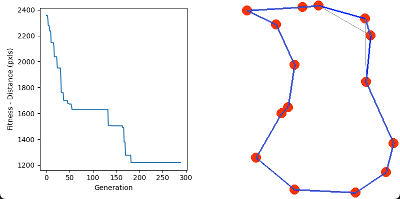

# TSP Solver — Genetic Algorithm (Python)

Uma implementação em Python de um solucionador para o problema do Caixeiro Viajante (TSP) usando Algoritmo Genético (GA) com visualização via Pygame.


## Visão geral
O projeto cria e evolui uma população de rotas (permutations de cidades) usando operadores típicos de GA (crossover do tipo order, mutação, elitismo), e exibe em tempo real a melhor solução encontrada usando Pygame. Ao final, os melhores resultados são salvos em `top50_results.csv` e `top50_results.json`.
## Estrutura principal

- `tsp.py` — script principal que inicializa o problema, roda a simulação/visualização e salva os resultados.
- `genetic_algorithm.py` — implementação do GA (geração, fitness, crossover, mutação, ordenação).
- `draw_functions.py` — funções auxiliares para desenhar cidades, rotas e gráfico usando Matplotlib + Pygame.
- `benchmark_att48.py` — dados do benchmark att48 (opcional).
## Dependências

- Python 3.10+ (testado aqui com Python 3.13)
- numpy
- pygame
- matplotlib
O repositório contém um `environment.yml` para criação de ambiente Conda; alternativamente você pode instalar com pip.

### Usando Conda (recomendado)
```bash
conda env create --file environment.yml
conda activate fiap_tsp
### Usando virtualenv / pip

```bash
python -m venv .venv
source .venv/bin/activate    # ou .venv\Scripts\activate no Windows (PowerShell: .venv\Scripts\Activate.ps1)
pip install --upgrade pip
pip install numpy pygame matplotlib
## Como executar

Abra um terminal no diretório do projeto e execute:
```bash
# usando o python do ambiente ativo
python tsp.py
Observações:
- O script abre uma janela do Pygame para visualização. Pressione a tecla `q` ou feche a janela para encerrar.
- Parâmetros importantes estão no topo de `tsp.py` e podem ser alterados:
  - `TIME_LIMIT_SECONDS` — tempo máximo de execução (padrão: 10 ou 120 conforme edição)
### Modos de problema

O `tsp.py` permite três modos (descomentar/ajustar no arquivo):
- Geração aleatória de cidades (recomendado para testes rápidos)
- Problemas pré-definidos (`default_problems` — 10, 12 ou 15 cidades)
- Benchmark `att48` (dados em `benchmark_att48.py`)
Por padrão você pode ativar a geração aleatória definindo `cities_locations` usando coordenadas randômicas (veja os comentários em `tsp.py`).

## Saída
Ao terminar a execução, o script salva automaticamente:

- `top50_results.csv` — CSV com os top 50 resultados (rank, generation, fitness, rota)
- `top50_results.json` — JSON estruturado com metadata e top results
Exemplo de uso programático: você pode ler `top50_results.json` para analisar os melhores trajetos e gerar imagens estáticas.

## Troubleshooting
- ModuleNotFoundError para `pygame` / `matplotlib` / `numpy`: instale as dependências conforme instruções acima.
- Se o Matplotlib reportar warnings de muitas figuras abertas, atualize `draw_functions.py` (já incluí uma chamada a `plt.close(fig)` para mitigar isso).
- Em ambientes sem display (servidores/CI) a janela do Pygame pode falhar; para rodar em modo "headless" você precisará adaptar `draw_functions.py` (gerar imagens sem abrir janela) ou usar um framebuffer virtual.
## Contribuições

Melhorias bem-vindas: parâmetros de seleção e recombinação, heurísticas iniciais (nearest neighbor), exportar imagem com a melhor rota, experimentos automatizados (benchmarks/variações de parâmetros).
## Licença

Este projeto está licenciado sob a MIT License — ver arquivo `LICENSE`.

---
Se quiser, eu atualizo o `tsp.py` para que ele ative automaticamente a geração aleatória de cidades (em vez do benchmark att48), e posso rodar o script por X segundos e mostrar os 5 melhores resultados do `top50_results.json`. Me diga o que prefere.
# TSP Solver using Genetic Algorithm

This repository contains a Python implementation of a Traveling Salesman Problem (TSP) solver using a Genetic Algorithm (GA). The TSP is a classic problem in the field of combinatorial optimization, where the goal is to find the shortest possible route that visits a set of given cities exactly once and returns to the original city.



## Prerequisites

- Download and Install conda environment manager.
  -  https://www.anaconda.com/download
- Open the `Anaconda Prompt`
- create the `fiap_tsp` environment
  - `conda env create --file environment.yml`
- activate the environment
  - `conda activate fiap_tsp`  

## How to Run

Execute the following command in your terminal to run the program:

### Pygame
```bash
python tps.py
```
> Press the 'q' key to quit the program.


## Overview

The TSP solver employs a Genetic Algorithm to iteratively evolve a population of candidate solutions towards an optimal or near-optimal solution. The GA operates by mimicking the process of natural selection, where individuals with higher fitness (i.e., shorter route distance) are more likely to survive and produce offspring.

## Files

- **genetic_algorithm.py**: Contains the implementation of the Genetic Algorithm, including functions for generating random populations, calculating fitness, performing crossover and mutation operations, and sorting populations based on fitness.
- **tsp.py**: Implements the main TSP solver using Pygame for visualization. It initializes the problem, creates the initial population, and iteratively evolves the population while visualizing the best solution found so far.
- **draw_functions.py**: Provides functions for drawing cities, paths, and plots using Pygame.

## Usage

To run the TSP solver, execute the `tsp.py` script using Python. The solver allows you to choose between different problem instances:

- Randomly generated cities
- Default predefined problems with 10, 12, or 15 cities
- `att48` benchmark dataset (uncomment relevant code in `tsp.py`)

You can customize parameters such as population size, number of generations, and mutation probability directly in the `tsp.py` script.

## Dependencies

- Python 3.x
- Pygame (for visualization)

Ensure Pygame is installed before running the solver. You can install Pygame using pip:

```bash
pip install pygame
```

## Acknowledgments

This TSP solver was developed as a learning project and draws inspiration from various online resources and academic materials on Genetic Algorithms and the Traveling Salesman Problem. Special thanks to the authors of those resources for sharing their knowledge.

## License

This project is licensed under the [MIT License](LICENSE).

---

Feel free to contribute to this repository by providing enhancements, bug fixes, or additional features. If you encounter any issues or have suggestions for improvements, please open an issue on the repository. Happy solving!