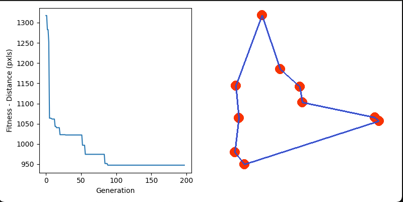

# TSP Solver — Genetic Algorithm (Python)

Uma implementação em Python de um solucionador para o problema do Caixeiro Viajante (TSP) usando Algoritmo Genético (GA) com visualização via Pygame.


## Visão geral
O projeto cria e evolui uma população de rotas (permutations de cidades) usando operadores típicos de GA (crossover do tipo order, mutação, elitismo), e exibe em tempo real a melhor solução encontrada usando Pygame. Ao final, os melhores resultados são salvos em `top50_results.csv` e `top50_results.json`.
## Estrutura principal

- `tsp.py` — script principal que inicializa o problema, roda a simulação/visualização e salva os resultados.
- `genetic_algorithm.py` — implementação do GA (geração, fitness, crossover, mutação, ordenação).
- `draw_functions.py` — funções auxiliares para desenhar cidades, rotas e gráfico usando Matplotlib + Pygame.
- `benchmark_att48.py` — dados do benchmark att48 (opcional).
## Dependências

- Python 3.10+ (testado aqui com Python 3.13)
- numpy
- pygame
- matplotlib
O repositório contém um `environment.yml` para criação de ambiente Conda; alternativamente você pode instalar com pip.

### Usando Conda (recomendado)
```bash
conda env create --file environment.yml
conda activate fiap_tsp
### Usando virtualenv / pip

```bash
python -m venv .venv
source .venv/bin/activate    # ou .venv\Scripts\activate no Windows (PowerShell: .venv\Scripts\Activate.ps1)
```markdown
# Otimização de Rotas Médicas — Algoritmo Genético (Python)

Este repositório implementa um sistema de otimização de rotas para entregas médicas usando um Algoritmo Genético (AG) com visualização via Pygame.


## Visão geral
Gera rotas para uma frota de veículos que atendem entregas com diferentes prioridades (CRITICAL, HIGH, MEDIUM, LOW). Na inicialização, uma janela Pygame coleta os parâmetros: número de cidades, número de veículos e tempo máximo de execução. Ao término, o sistema salva as melhores soluções (PNG com mapa/rotas e CSV com rotas por veículo).

## Arquivos principais
- `src/main.py` — orquestra execução e UI (entrada via Pygame), loop do AG e salvamento de artefatos (PNG/CSV).
- `src/population.py` — criação de população, fitness, divisão de entregas e otimizações locais (inclui ordenação por prioridade dentro das rotas).
- `src/models.py` — modelos de dados (`Delivery`, `Priority`).
- `src/visualization.py` — desenho de entregas, rotas e legenda (legenda é adicionada apenas nas imagens salvas).
- `src/config.py` — parâmetros e constantes.

## Saída gerada
- PNGs com as melhores soluções (quando gerados localmente): `src/images/top_1.png` … `top_5.png`
- CSVs com rotas detalhadas por veículo (quando gerados localmente): `src/images/top_1.csv` … `top_5.csv`
- Relatório técnico: `REPORT_FASE2.md` e `REPORT_FASE2.pdf`

> Observação: por padrão `src/images/` não é versionado (arquivos gerados localmente). Se precisar que eu gere e compartilhe artefatos, posso re-gerar e subir separadamente.

## Como executar (sem Conda) — Windows (cmd / PowerShell)
1. Clone o repositório e entre na pasta do projeto.

2. Crie um ambiente virtual e ative (cmd):

```cmd
python -m venv .venv
.venv\Scripts\activate
```

No PowerShell:

```powershell
python -m venv .venv
.\\.venv\\Scripts\\Activate.ps1
```

3. Instale as dependências via pip:

```bash
pip install -U pip
pip install pygame numpy matplotlib reportlab Pillow
```

4. Execute o programa:

```bash
python src/main.py
```

Ao iniciar, a janela pedirá os três parâmetros; pressione Enter para aceitar o padrão.

Execução automatizada (headless): para rodar sem interação (usar defaults) você pode simular Enter:

```bash
# no bash do Git for Windows
printf '\\n\\n\\n' | .venv/Scripts/python.exe src/main.py
```

## Relatório e documentação
O relatório técnico da Fase 2 está disponível em `REPORT_FASE2.md` e em PDF `REPORT_FASE2.pdf`.

## Dependências
- Python 3.10+ (testado com 3.13)
- pygame, numpy, matplotlib
- reportlab, Pillow (opcionais, para geração de PDF)

Se preferir, eu posso criar um `requirements.txt` com as versões testadas.

## Observações e próximos passos
- `src/images/` está listado em `.gitignore` (artefatos gerados não são versionados). Se quiser que eu re-adicione imagens/CSVs ao repositório temporariamente para revisão, posso fazer.
- Recomendações:
  - Adicionar testes unitários para funções centrais (`src/population.py`).
  - Implementar heurísticas locais adicionais (2-opt) preservando prioridade.
  - Gerar CSV mestre agregando as 5 melhores soluções.

## Licença
MIT — veja `LICENSE`.

---

Se quiser que eu: (A) re-adicione artefatos temporariamente; (B) gere um release no GitHub com o `REPORT_FASE2.pdf`; ou (C) atualize o `requirements.txt`, diga qual opção prefere.
```