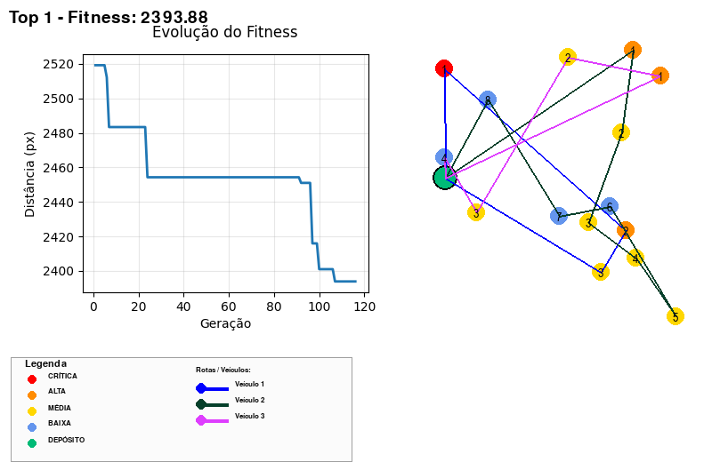

# Relatório Técnico — Tech Challenge Fase 2

## 1. Título
Otimização de Rotas Médicas — Tech Challenge Fase 2

## 2. Objetivo
Descrever a implementação, validação e resultados da otimização de rotas para entregas médicas usando um Algoritmo Genético (AG). Inclui instruções de execução, decisões de projeto, artefatos gerados (imagens e CSVs) e próximos passos.

## 3. Resumo executivo
Implementamos um AG em Python com interface Pygame para entrada de parâmetros em tempo de execução (número de cidades, número de veículos e tempo limite). A visualização gera mapas das rotas e grava cinco melhores soluções como PNGs e CSVs contendo rotas por veículo. Foi adicionada uma garantia de prioridade nas rotas — sempre respeitando a ordem CRITICAL → HIGH → MEDIUM → LOW dentro de cada rota.

## 4. Tecnologias usadas
- Python 3.x
- Pygame — interface gráfica e rendering
- matplotlib (FigureCanvasAgg) — plot de evolução do AG convertido para Pygame
- NumPy — buffer conversão imagem
- csv — exportação de rotas
- Git — versionamento (branch `weslley`)

## 5. Como executar
1. Crie/ative um ambiente Python (ex.: venv/conda).
2. Instale dependências (use o `environment.yml` se estiver usando Conda) ou instale via pip conforme necessário.
3. Execute o script principal:

```bash
python main.py
```

4. A janela do Pygame pedirá: número de cidades, número de veículos e tempo de execução (segundos). Pressione Enter para aceitar padrão.
5. Ao terminar, as imagens e CSVs estarão em `src/images/`.

## 6. Arquitetura e design
- `main.py`: orquestra entrada, loop do AG, desenho em tela e lógica de salvar imagens/CSV.
- `models.py`: dataclasses (Delivery) e enum `Priority` (CRITICAL, HIGH, MEDIUM, LOW).
- `population.py`: lógica de geração, fitness, divisão de entregas por veículo e otimização local.
  - Modificação chave: `optimize_route_respecting_priority` — assegura que, dentro de cada veículo, as entregas aparecem em blocos por prioridade (CRITICAL → HIGH → MEDIUM → LOW) e aplica NN (Nearest Neighbor) dentro de cada bloco para melhorar sequência espacial sem violar prioridade.
- `visualization.py`: desenho de pontos, rotas e função `draw_legend`. A legenda foi retirada da renderização em tela e colocada apenas nas imagens salvas (`save_surface`) para evitar sobreposição visual durante execução.
- CSV export: criado ao salvar cada solução com colunas:
  - `SolutionRank,Fitness,VehicleID,DeliveryIDs,NumDeliveries,TotalWeight,Distance,Priorities`

## 7. Algoritmo Genético (detalhes)
- Representação: cromossoma contendo alocação de entregas entre veículos + sequência (rota) por veículo.
- Fitness: soma das distâncias por veículo + penalidades por violar capacidade/tempo (implementado em `population.py`).
- Operadores:
  - Seleção: torneio / roleta (conforme implementação atual).
  - Crossover: operador custom (mantém sequência/atribuição).
  - Mutação: pequenas permutações / movimento entre veículos.
- Parâmetros padrão: definidos em `config.py`.
- Otimização local: nearest-neighbor aplicado dentro de rotas (com agrupamento por prioridade).

## 8. Resultados e evidências
A execução gera logs de convergência por geração e salva as 5 melhores soluções como PNG + CSV.

Exemplo de linhas do CSV `src/images/top_1.csv`:

```
SolutionRank,Fitness,VehicleID,DeliveryIDs,NumDeliveries,TotalWeight,Distance,Priorities
1,3489.46,1,4;0;1,3,48.36,679.5953541816605,CRITICAL;LOW;LOW
1,3489.46,2,11;8;3;12;14,5,83.27,767.5613368274677,MEDIUM;HIGH;MEDIUM;MEDIUM;LOW
1,3489.46,3,9;2;5,3,30.82,577.2784328833801,LOW;HIGH;MEDIUM
1,3489.46,4,10;7,2,32.91,356.24903720808675,MEDIUM;HIGH
1,3489.46,5,6;13,2,39.57,331.77766082298075,MEDIUM;MEDIUM
```

Trecho de `src/images/top_3.csv`:

```
SolutionRank,Fitness,VehicleID,DeliveryIDs,NumDeliveries,TotalWeight,Distance,Priorities
3,3559.57,1,4;0;1,3,48.36,679.5953541816605,CRITICAL;LOW;LOW
3,3559.57,2,11;8;3;12;14,5,83.27,767.5613368274677,MEDIUM;HIGH;MEDIUM;MEDIUM;LOW
3,3559.57,3,9;2;5,3,30.82,577.2784328833801,LOW;HIGH;MEDIUM
3,3559.57,4,13;7,2,38.29,393.76723501126065,MEDIUM;HIGH
3,3559.57,5,6;10,2,34.19,314.37222383530803,MEDIUM;MEDIUM
```

## 9. Miniaturas das imagens salvas
As imagens geradas estão em `src/images/`. Incluo aqui miniaturas inline para rápida visualização no Markdown.

> Observação: o Markdown renderizado localmente no GitHub exibirá as imagens; para visualização no editor local, abra os arquivos de imagens.


{width=350}

{width=350}

{width=350}

{width=350}

{width=350}

## 10. Validação e testes
- Testes manuais: execução com entradas padrão (simulando Enter) para garantir que o AG corre, salva imagens e gera CSVs.
- Verificações:
  - Confirmação de artefatos em `src/images/`.
  - Visual inspeção das PNGs (legenda somente nas imagens salvas).
  - Verificação de que as `Priorities` nas CSVs seguem a ordem quando aplicável.

## 11. Limitações e riscos
- Otimização espacial é local (NN dentro de blocos), não global ótimo — trade-off para garantir prioridade.
- Artefatos PNG/CSV atualmente no repositório; considere adicionar `src/images/` ao `.gitignore` se não quiser versionar.

## 12. Próximos passos
- Revisar e aprovar o relatório.
- (Opcional) Gerar PDF e salvar em `docs/`.
- Adicionar testes unitários para funções centrais.
- (Opcional) Implementar heurísticas locais adicionais (2-opt) sem violar prioridade.

---

*Gerado automaticamente como rascunho. Revise e diga se quer que eu gere o PDF e/ou commite esse arquivo.*